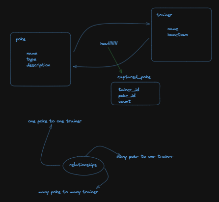
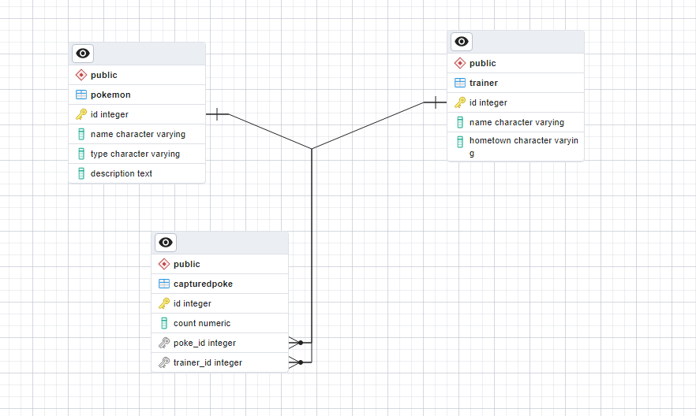

  

[circleci-image]: https://img.shields.io/circleci/build/github/nestjs/nest/master?token=abc123def456
[circleci-url]: https://circleci.com/gh/nestjs/nest

# NestJs Poc

Here is a brief description of how the entities are structured in the project:

- Pokemon: This entity contains information about a pokemon such as its name, type.
- Trainer: This entity contains information about a trainer such as their name and hometown.
- CapturedPokemon: This entity contains information about a captured pokemon such as the date it was captured and the trainer who captured it.

## Idea

  

## Erd

  

